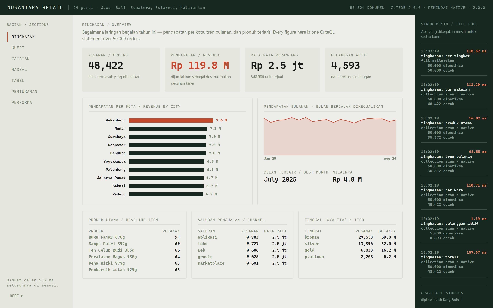
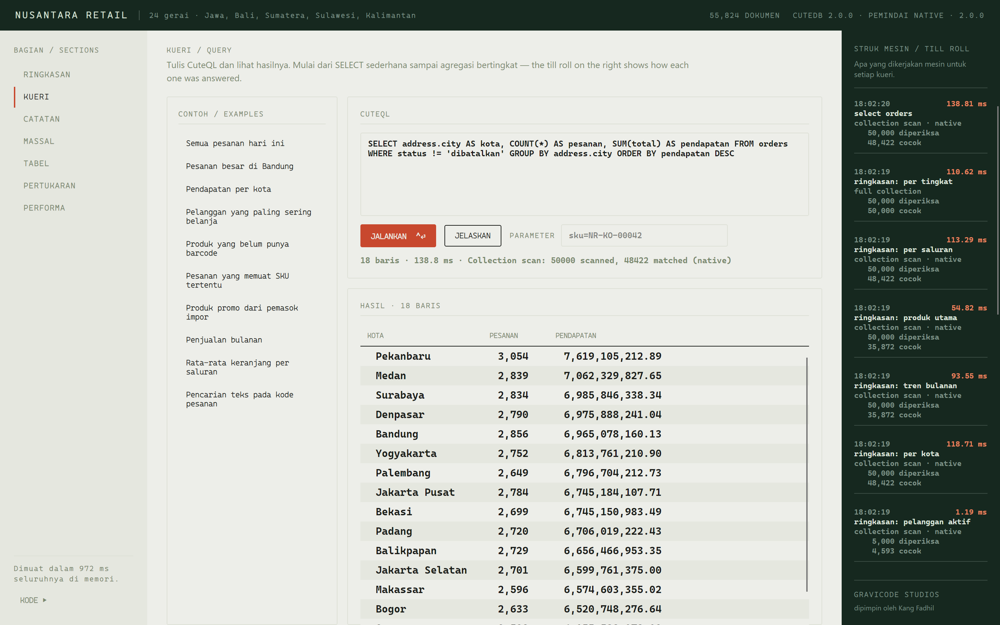
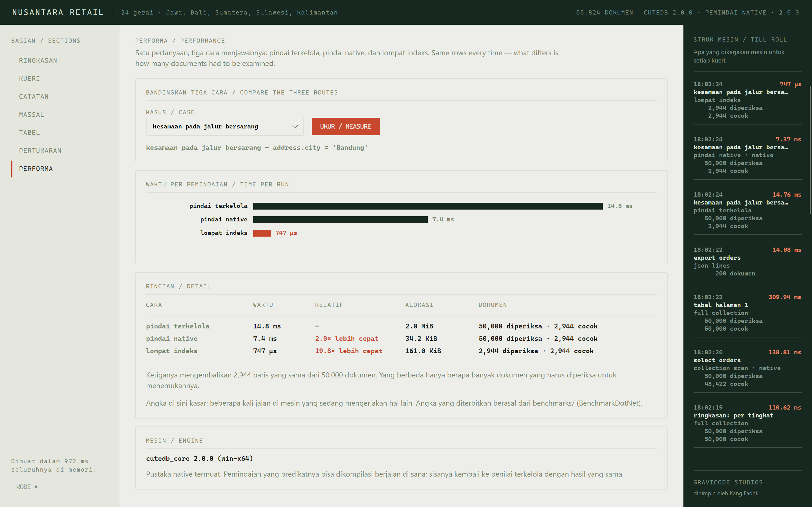
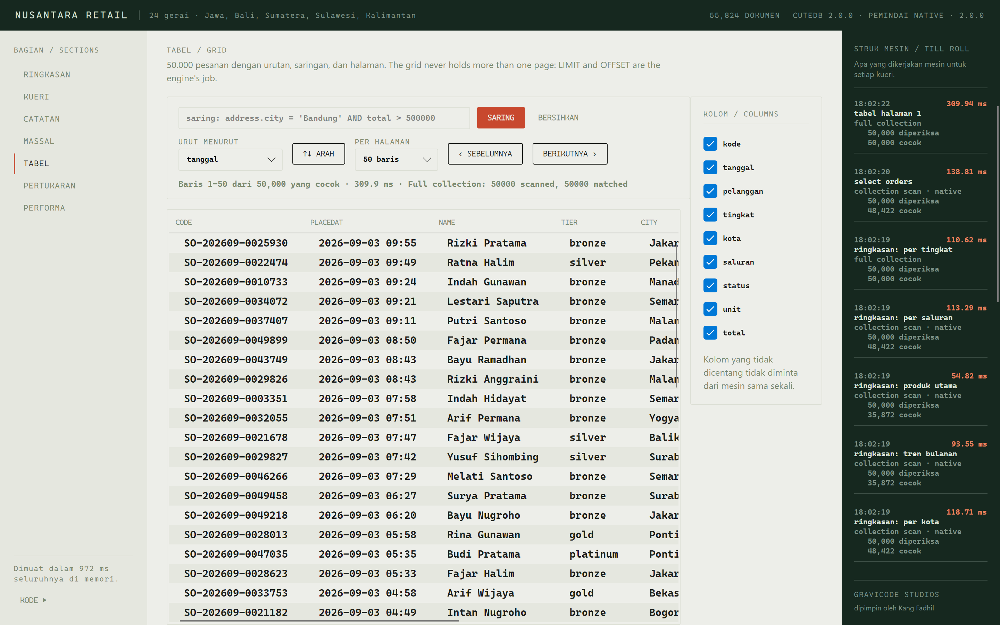
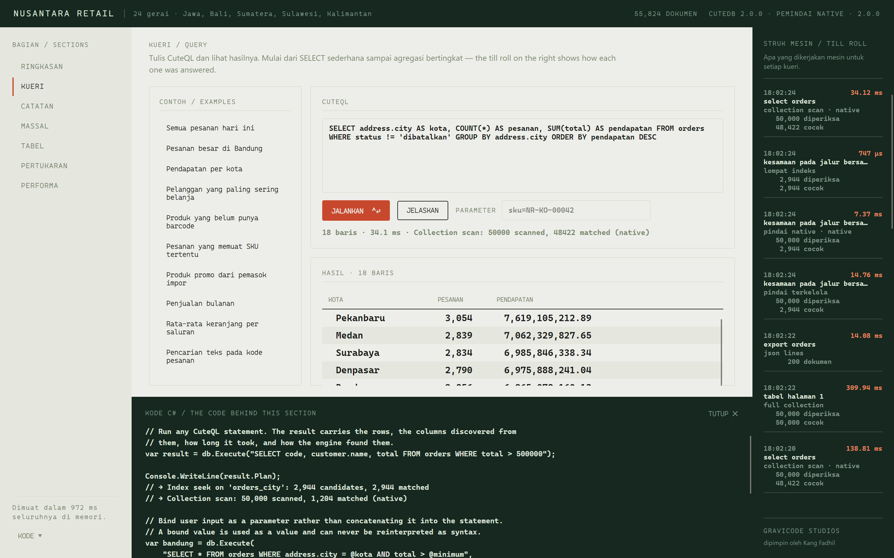
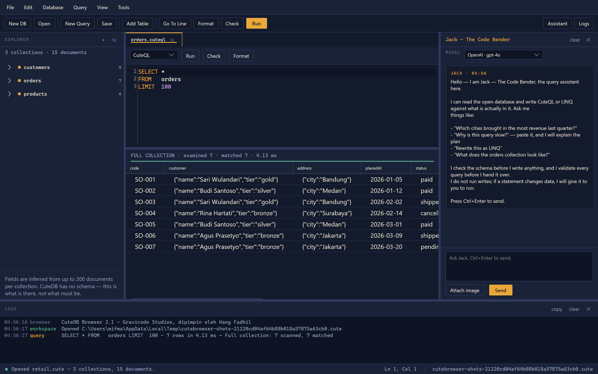
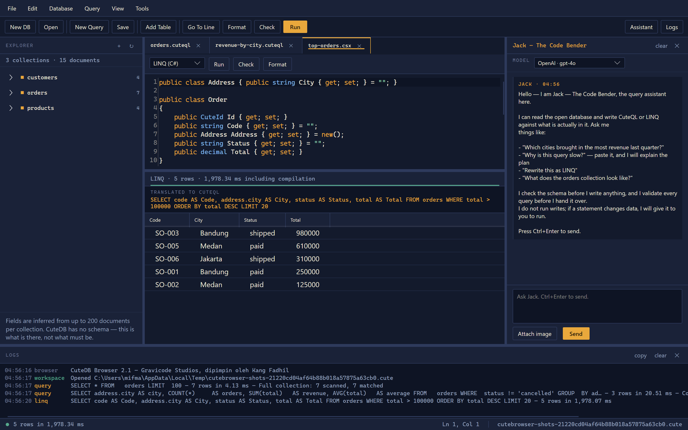
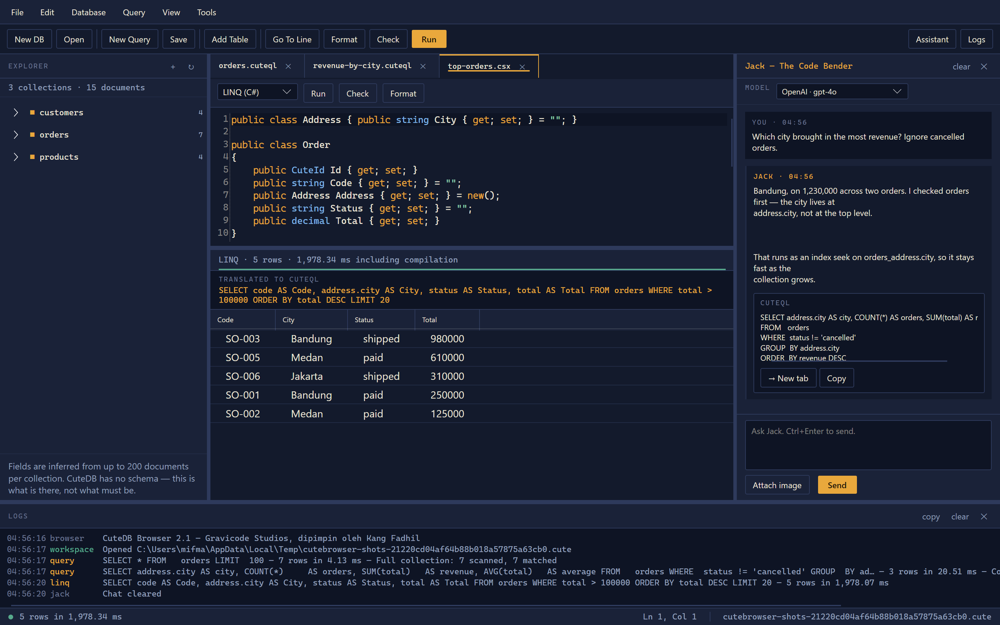

# CuteDB

**Basis data dokumen tertanam yang imut untuk .NET 10.**
Dokumen JSON sungguhan, dialek SQL kecil, dan berkas yang selamat walau prosesnya dimatikan di tengah tulisan — dalam satu paket NuGet, tanpa server dan tanpa dependensi.

*[Read in English →](README.md)*

Dibuat oleh **Gravicode Studios**, dipimpin oleh **Kang Fadhil**.

[](https://github.com/DotNetVibeCoderz/Vibe_Database/actions/workflows/cutedb-ci.yml)
[](https://www.nuget.org/packages/CuteDB)
[](LICENSE)

---

```csharp
using var db = CuteDatabase.Open("toko.cute");

db.Collection("orders").Insert(CuteDocument.Parse("""
    {
      "customer": { "name": "Sari", "tier": "gold" },
      "address":  { "city": "Bandung" },
      "lines":    [ { "sku": "KB-01", "qty": 2 } ],
      "total":    249000
    }
    """));

var pendapatan = db.Execute("""
    SELECT address.city AS kota, SUM(total) AS pendapatan
    FROM   orders
    WHERE  status != 'dibatalkan'
    GROUP  BY address.city
    ORDER  BY pendapatan DESC
    """);
```

Tidak ada skema yang perlu dideklarasikan, tidak ada migrasi, tidak ada server yang harus dijalankan. `address.city` menjangkau ke dalam subdokumen; `SUM` atas desimal tetap persis.

---

## Kenapa basis data tertanam lagi

Kebanyakan penyimpanan tertanam untuk .NET memaksa memilih: yang relasional, yang butuh skema dan memipihkan objek Anda; atau yang dokumen, yang menyimpan objek Anda tetapi hanya bisa mencarinya lewat kunci. CuteDB adalah penyimpanan dokumen yang benar-benar bisa dikueri — dan dirancang supaya kueri tetap cepat tanpa indeks, karena justru pemindaian itulah yang biasanya lambat di penyimpanan tertanam lain.

**Dokumen tahu di mana field-nya berakhir.** Dokumen disimpan dalam format biner yang setiap wadahnya membawa panjangnya sebelum isinya. Membaca `customer.address.city` dari sebuah pesanan tersimpan langsung melompati semua yang tidak diperlukan:

| Operasi pada satu dokumen pesanan | Waktu | Alokasi |
| --- | ---: | ---: |
| Membaca satu field bersarang, tanpa mendekode | **155 ns** | **32 B** |
| Mendekode seluruh dokumen, lalu membaca field itu | 10.305 ns | 11.592 B |

Selisih 66× itulah inti rancangannya. Pemindaian bersaring atas sejuta dokumen tidak pernah mewujudkan 99% bagian dokumen yang tidak ditanyakan.

**Dokumen hidup di luar dunia GC.** Semuanya dipadatkan ke dalam blok memori tak terkelola 4 MiB yang dialamati oleh tabel datar. Sejuta dokumen adalah beberapa ratus blok yang tidak pernah ditelusuri pemulung memori — bukan sejuta objek hidup dengan sejuta header objek.

**Akselerator Rust opsional.** Predikatnya dikompilasi menjadi bytecode dan seluruh pemindaian berjalan di seberang satu P/Invoke, sehingga hampir tidak mengalokasikan apa pun per baris. Ini optimisasi, bukan keharusan: mesin terkelola menerapkan semantik yang sama, dan [rangkaian uji paritas](tests/CuteDB.Tests/NativeParityTests.cs) menjalankan 35 predikat lewat keduanya dan menuntut jawaban yang identik.

---

## Aplikasi contoh

`samples/CuteDB.Demo` adalah aplikasi Avalonia atas sebuah jaringan ritel Indonesia fiktif — 24 gerai, 5.000 pelanggan, 800 produk, 50.000 pesanan. Setiap bagian membawa kode C# di baliknya, dan struk di tepi kanan mencetak apa yang dikerjakan mesin untuk setiap kueri: jalur akses mana, berapa dokumen yang diperiksa, berapa yang cocok, dan berapa lama.



```bash
dotnet run --project samples/CuteDB.Demo
```

<table>
<tr>
<td width="50%"><br /><b>Kueri</b> — sepuluh contoh, dari proyeksi sederhana sampai agregasi berkelompok atas ekspresi terhitung.</td>
<td width="50%"><br /><b>Performa</b> — satu pertanyaan, tiga cara, baris yang sama. Diukur langsung di mesin Anda.</td>
</tr>
<tr>
<td width="50%"><br /><b>Tabel</b> — 50.000 pesanan dengan urutan, saringan, pilihan kolom, dan halaman. Tabelnya tidak pernah memuat lebih dari satu halaman.</td>
<td width="50%"><br /><b>Kode</b> — setiap bagian menampilkan kode yang benar-benar dijalankannya, bukan ilustrasinya.</td>
</tr>
</table>

Lainnya: [catatan](docs/images/03-catatan.png) · [muat massal](docs/images/04-massal.png) · [impor & ekspor](docs/images/06-pertukaran.png)

---

## Pasang

```bash
dotnet add package CuteDB                 # pustakanya
dotnet tool install -g CuteDB.Cli         # perintah cutedb
dotnet tool install -g CuteDB.Server      # server HTTP, untuk klien Python/Go/Node
```

Paketnya membawa akselerator native untuk keenam runtime — `win-x64`, `win-arm64`, `linux-x64`, `linux-arm64`, `osx-x64`, `osx-arm64`. Alur rilis membangun semuanya dan lebih baik gagal daripada menerbitkan paket yang kehilangan salah satunya, jadi paket yang ada pasti membawa runtime yang Anda butuhkan. Di luar itu CuteDB memakai pemindai terkelola: semantiknya identik, 1,3–1,8× lebih lambat pada pemindaian besar, dan tidak ada fitur yang hilang.

---

## Apa yang bisa dilakukan

### Dokumen bebas bentuk

```csharp
var products = db.Collection("products");

products.Insert(CuteDocument.Parse("""
    { "sku": "NR-KO-00042", "name": "Kopi Gayo 250g", "price": 68000,
      "tags": ["promo", "lokal"],
      "supplier": { "name": "PT Sumber Makmur", "leadTimeDays": 7 } }
    """));

// Yang berikutnya tidak harus mirip yang pertama.
products.Insert(CuteDocument.Parse("""{ "sku": "NR-AT-00007", "name": "Pena", "discontinued": true }"""));
```

Objek bersarang, larik, tipe campur antar dokumen dalam satu koleksi. `decimal`, `DateTime`, `Guid`, dan id dokumen disimpan apa adanya, bukan dipipihkan menjadi teks.

### CuteQL: SQL di tempat SQL cocok, jalur di tempat SQL tidak cocok

```sql
SELECT customer.name AS pelanggan, SUM(total) AS belanja
FROM   orders
WHERE  address.city IN ('Bandung', 'Medan')
   AND placedAt BETWEEN '2026-01-01' AND '2026-06-30'
   AND tags = 'promo'                 -- field berisi larik dicocokkan per elemen
   AND discount IS MISSING            -- "tidak ada" beda pertanyaan dengan IS NULL
GROUP  BY customer.name
HAVING COUNT(*) > 3
ORDER  BY belanja DESC
LIMIT  25
```

`SELECT`, `INSERT`, `UPDATE`, `DELETE`; `AND`/`OR`/`NOT`, `IN`, `LIKE`, `BETWEEN`, `IS NULL`, `IS MISSING`; `GROUP BY`, `HAVING`, `ORDER BY`, `LIMIT`/`OFFSET`, `DISTINCT`; lima agregat dan sekitar tiga puluh fungsi skalar. Tiga hal yang sengaja berbeda dari SQL dijelaskan di [rujukan CuteQL](docs/id/cuteql.md).

Ikat nilainya, jangan disambung sebagai teks:

```csharp
db.Execute("SELECT * FROM orders WHERE address.city = @kota AND total > @minimum",
    ("kota",    CuteValue.String(masukanPengguna)),
    ("minimum", CuteValue.Decimal(500_000m)));
```

### LINQ, dan kueri yang dihasilkannya

```csharp
using CuteDB.Linq;

var query = db.Collection("orders").Query<Order>()
    .Where(o => o.Address.City == "Bandung" && o.Total > 500_000m)
    .OrderByDescending(o => o.Total)
    .Take(10);

Console.WriteLine(query.ToCuteQL());
// SELECT * FROM orders WHERE address.city = 'Bandung' AND total > 500000 ORDER BY total DESC LIMIT 10

foreach (var order in query) { … }
```

Seluruh rantai menjadi **satu statement** — penyaringan, pengurutan, pengelompokan, agregasi, dan
paging semuanya terjadi di dalam mesin. `Count()` menjalankan `SELECT COUNT(*)`, bukan menghitung
baris di memori; `First()` menambahkan `LIMIT 1`.

`ToCuteQL()` adalah inti dari fitur ini. Provider yang tidak bisa Anda lihat isinya adalah provider
yang tidak bisa Anda debug, jadi setiap kueri mencetak statement yang akan dijalankannya, dan
teksnya bisa di-parse kembali menjadi hal yang sama — bisa langsung ditempel ke `cutedb shell`.

```csharp
var (rows, diagnostics) = query.ToListWithDiagnostics();
Console.WriteLine(diagnostics);   // 11 rows · 4.52 ms · Index seek on 'orders_city'
```

Jalur bersarang, `LIKE` dari `StartsWith`/`Contains`, `IN` dari `Contains` atas koleksi lokal,
`IS NULL` dari `== null`, bagian tanggal, enum yang dibandingkan berdasarkan nama, `GroupBy` dengan
`HAVING`, dan `o.Lines.Any(l => l.Qty > 3)` yang menjadi jalur proyeksi `lines[].qty > 3`. Apa pun
yang tidak bisa diterjemahkan akan melempar exception dan menyebutkan penyebabnya, alih-alih
diam-diam memuat seluruh koleksi ke memori. Rujukan lengkap: [docs/id/linq.md](docs/id/linq.md).

### Tanyakan bagaimana kueri akan dijalankan

```csharp
var plan = db.Explain("SELECT * FROM orders WHERE address.city = 'Bandung'");
// Index seek on 'orders_city': 2,944 candidates, 2,944 matched
```

### Keselamatan dari mati mendadak, tanpa disetel

Berkasnya adalah log yang hanya bertambah: satu bingkai entah mendarat utuh — panjang dan CRC-32C-nya cocok — atau dibuang saat pembukaan berikutnya. Tidak ada WAL terpisah, tidak ada mode pemulihan, tidak ada yang perlu disetel.

```csharp
using var db = CuteDatabase.Open("toko.cute");
if (db.DiscardedBytesOnOpen > 0)
{
    // Proses sebelumnya terputus saat menulis. Semua yang sebelum titik itu utuh.
}
```

`db.Compact()` menulis ulang berkas hanya dengan keadaan terkini ketika riwayatnya sudah terlalu panjang.

---

## CuteDB Browser

`tools/CuteBrowser` adalah meja kerja desktop: menjelajahi basis data, menulis CuteQL atau LINQ, dan
melihat apa yang sebenarnya dikerjakan mesin untuk menjawabnya.



```bash
dotnet run --project tools/CuteBrowser
```

Strip di antara editor dan grid adalah intinya. Ia mencetak apa yang dikerjakan mesin —
`COLLECTION SCAN · examined 50,000 · matched 4,182 · returned 12 · 38.50 ms · native` — dan menggambar
garis yang bagian terisinya adalah matched dibagi examined. Sepotong kecil berarti mesin memeriksa
lima puluh ribu dokumen untuk mengembalikan dua belas, dan untuk itulah indeks ada.

<table>
<tr>
<td width="50%"><br /><b>Tab LINQ</b> — skrip C# dengan basis data dalam cakupan, dan CuteQL hasil terjemahannya tercetak di atas grid.</td>
<td width="50%"><br /><b>Jack — The Code Bender</b> — membaca skema sebelum menulis apa pun, memvalidasi yang ditulisnya, dan mengirim setiap kueri ke tab dengan sekali klik.</td>
</tr>
</table>

Jack berjalan di atas OpenAI, Azure OpenAI, Claude, Gemini, Ollama, atau apa pun lain yang berbicara
API OpenAI, lewat Semantic Kernel. Dia bisa membaca koleksi, menjabarkan jalur field yang
sebenarnya, mempratinjau dan menjelaskan kueri, mencari di web, dan berhitung — tetapi dia tidak
bisa menjalankan penulisan; itu selalu lewat Anda.

Skrip pemasangan untuk Windows, Linux, dan macOS ada di `tools/CuteBrowser/scripts`. Panduan
lengkap: [docs/id/browser.md](docs/id/browser.md).

---

## Baris perintah

```bash
cutedb seed toko.cute --scale demo       # 55.824 dokumen contoh
cutedb info toko.cute                    # koleksi, indeks, ukuran, memori
cutedb shell toko.cute                   # CuteQL interaktif
cutedb query toko.cute "SELECT address.city, COUNT(*) FROM orders GROUP BY address.city"
cutedb export toko.cute orders --out orders.jsonl
cutedb import toko.cute orders.jsonl --collection orders --decimal
cutedb bench --rows 250000
```

`--format json|jsonl|csv` tersedia di `query` dan `export`, jadi keluarannya bisa langsung dialirkan ke alat lain. Rujukan lengkap: [docs/id/cli.md](docs/id/cli.md).

---

## Klien untuk Python, Go, dan Node.js

CuteDB itu tertanam, jadi kliennya berbicara dengan `cutedb-server` — satu titik akhir HTTP jauh lebih kecil untuk dijaga kebenarannya lintas tiga bahasa dan enam platform daripada tiga set binding native.

```bash
cutedb-server toko.cute --port 8420
```

```python
from cutedb import CuteClient

db = CuteClient("http://127.0.0.1:8420")
hasil = db.query("SELECT address.city AS kota, SUM(total) AS pendapatan FROM orders GROUP BY address.city")
```

```go
client := cutedb.New("http://127.0.0.1:8420")
hasil, err := client.Query(ctx, "SELECT * FROM orders WHERE total > @min",
    map[string]any{"min": 500000})
```

```javascript
const db = new CuteClient("http://127.0.0.1:8420");
const orders = db.collection("orders");
await orders.insertMany(batch);          // satu permintaan, satu kunci, satu flush
```

Ketiganya tanpa dependensi. Rincian di [docs/id/server-dan-klien.md](docs/id/server-dan-klien.md); API-nya mendeskripsikan dirinya di `/openapi.json`.

---

## Performa

Diukur dengan BenchmarkDotNet pada Intel Core i7-8650U (4 inti fisik, silikon laptop 2018), .NET 10.0.11, Windows 11. Reproduksi dengan `dotnet run -c Release --project benchmarks/CuteDB.Benchmarks`, atau dapatkan angka kasar untuk mesin Anda dalam tiga puluh detik lewat `cutedb bench`.

**Menyaring 250.000 pesanan** — baris yang sama dari ketiga jalur:

| `WHERE address.city = 'Bandung'` | Waktu | Alokasi |
| --- | ---: | ---: |
| Pindai terkelola | 68,2 ms | 10.221 KB |
| Pindai native | **38,5 ms** | **130 KB** |
| Lompat indeks | **4,5 ms** | 737 KB |

Pemindai native 1,3–1,8× lebih cepat untuk berbagai bentuk predikat, dan mengalokasikan **78× lebih sedikit** — ia tidak pernah mewujudkan string per baris. Indeks 15× lebih cepat lagi, kalau memang ada yang bisa dipakai.

**Operasi lain:**

| | |
| --- | ---: |
| Sisip massal, di memori | 394.000 dok/detik |
| Pencarian titik lewat id | 566.000 op/detik |
| Ukuran terkodekan, dokumen pesanan realistis | 188 bita |
| Memori untuk 1.000.000 pesanan | 180 MiB tak terkelola, 55 MiB heap terkelola |

Tabel lengkap, metodenya, dan penjelasan jujur soal di mana CuteDB kalah: [docs/id/performa.md](docs/id/performa.md).

---

## Kapan CuteDB tidak cocok

Perlu dikatakan terus terang:

- **Data Anda tidak muat di memori.** Semuanya ditahan di memori selama basis data terbuka; berkasnya adalah catatan tahan lamanya. Kalau himpunan kerja Anda lebih besar dari RAM, pakai yang punya buffer pool — LiteDB atau SQLite.
- **Anda butuh penulis dari banyak proses.** Satu proses menulis pada satu waktu. Banyak pembaca tidak masalah; penulis serentak dari proses terpisah tidak didukung.
- **Anda butuh transaksi lintas dokumen.** Satu penulisan bersifat atomik. Tidak ada `BEGIN`/`COMMIT` yang mencakup beberapa dokumen.
- **Anda butuh join.** CuteQL tidak punya, dan itu disengaja — penyimpanan dokumen menanamkan apa yang di penyimpanan relasional harus di-join.

Kalau tidak satu pun berlaku, CuteDB cocok dan akan jauh lebih cepat daripada alternatifnya.

---

## Dokumentasi

| | Bahasa Indonesia | English |
| --- | --- | --- |
| Memulai | [memulai.md](docs/id/memulai.md) | [getting-started.md](docs/en/getting-started.md) |
| Rujukan CuteQL | [cuteql.md](docs/id/cuteql.md) | [cuteql.md](docs/en/cuteql.md) |
| LINQ | [linq.md](docs/id/linq.md) | [linq.md](docs/en/linq.md) |
| CuteDB Browser | [browser.md](docs/id/browser.md) | [browser.md](docs/en/browser.md) |
| Arsitektur | [arsitektur.md](docs/id/arsitektur.md) | [architecture.md](docs/en/architecture.md) |
| Performa | [performa.md](docs/id/performa.md) | [performance.md](docs/en/performance.md) |
| Baris perintah | [cli.md](docs/id/cli.md) | [cli.md](docs/en/cli.md) |
| Server & klien | [server-dan-klien.md](docs/id/server-dan-klien.md) | [server-and-clients.md](docs/en/server-and-clients.md) |
| Format berkas | [format-berkas.md](docs/id/format-berkas.md) | [file-format.md](docs/en/file-format.md) |

---

## Membangun dari sumber

```bash
git clone https://github.com/DotNetVibeCoderz/Vibe_Database.git
cd Vibe_Database/CuteDB

dotnet build CuteDB.slnx                 # semuanya
dotnet test tests/CuteDB.Tests           # 190 uji

pwsh native/build.ps1                    # akselerator Rust (opsional)
# atau: ./native/build.sh
```

Build .NET tidak pernah bergantung pada Rust. Tanpa itu akselerator tidak ada dan pemindaian memakai jalur terkelola; rangkaian ujinya tetap lulus sepenuhnya. CI membangunnya lebih dulu dan menyetel `CUTEDB_EXPECT_NATIVE=1`, yang membuat uji paritas gagal dengan berisik kalau pustakanya berhenti termuat.

---

## Naik dari CuteDB 1.x

Versi 2 adalah penulisan ulang: format berkas baru, mesin kueri baru, dan API publik yang hanya berbagi nama dengan versi 1. Berkas `.jdb` versi 1 adalah JSON Newtonsoft dengan `TypeNameHandling.All`, yang mengikatnya pada nama assembly Anda; berkas itu tidak dibaca langsung. Ekspor dari versi lama, lalu impor dengan `cutedb import --decimal`.

---

## Lisensi

MIT. Lihat [LICENSE](LICENSE).

Dibuat dengan sepenuh hati oleh [Gravicode Studios](https://github.com/DotNetVibeCoderz), dipimpin oleh Kang Fadhil.
*Jangan lupa kirim pulsa ya!* 🙂
