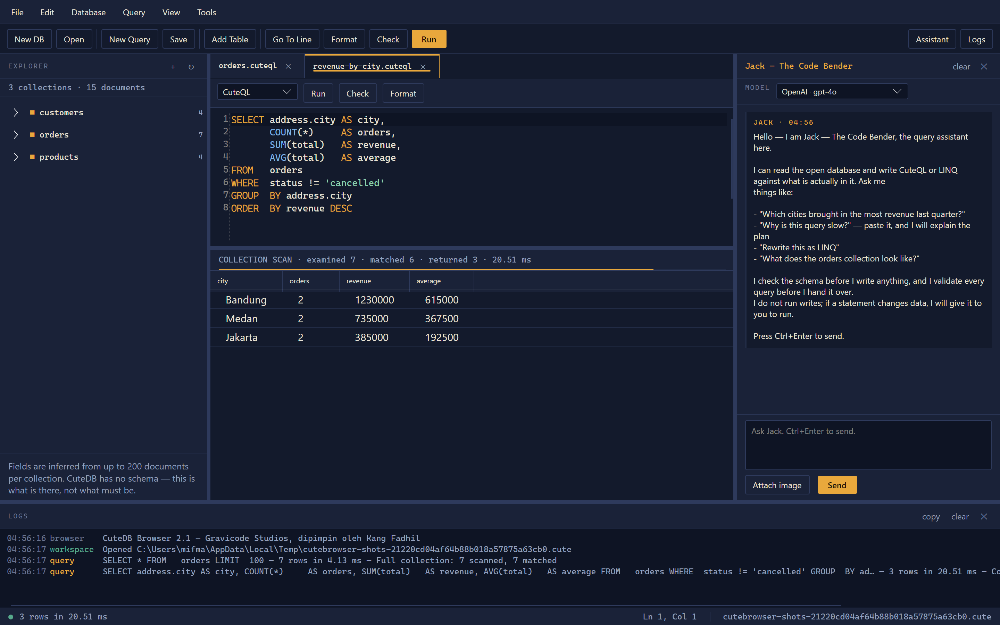
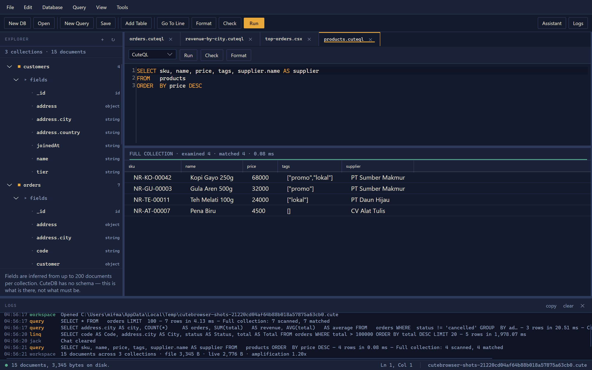

# CuteDB Browser

*Built by Gravicode Studios, led by Kang Fadhil.*

A desktop workbench for CuteDB: browse a database, write CuteQL or LINQ, see the rows, and see what
the engine actually did to get them. **Jack — The Code Bender** sits in the right-hand panel and
writes queries against the schema that is really there.


```bash
dotnet run --project tools/CuteBrowser
```

---

## The layout

One four-way split, and nothing else moves:

| Where | What | Toggle |
| --- | --- | --- |
| Left | Collections, their inferred fields, their indexes | drag the splitter |
| Middle | Query tabs — editor above, results below | — |
| Right | Jack, the assistant | `Ctrl+J` |
| Bottom | Everything the app did, with timestamps | `Ctrl+L` |

Both side panels collapse, and every width and height is remembered between sessions.

---

## The plan band

The strip between the editor and the grid is the point of the whole application:

```
COLLECTION SCAN · examined 50,000 · matched 4,182 · returned 12 · 38.50 ms · native
```

Under it is a rule whose filled fraction is *matched over examined*. A nearly full bar means the
access path was right. A sliver of turmeric means the engine looked at fifty thousand documents to
hand back twelve — which is what an index is for.

- **examined** — rows the access path produced before the predicate ran
- **matched** — rows that survived the predicate
- **returned** — rows that came back, which differs from matched whenever the query groups
- **native** — the Rust accelerator ran the scan; without it the managed evaluator did, with
  identical results

The band turns green when everything examined matched, and soga brown with the message when a query
fails.

---

## Writing queries



Each tab is CuteQL or C#, switchable from the picker at its top left. The editor has line numbers
(`Edit ▸ Show Line Numbers`), syntax highlighting written for CuteQL specifically — a field path
like `address.city` is coloured as a path, not as an identifier — and the usual editing.

| Command | Key | What it does |
| --- | --- | --- |
| Run | `F5` | Runs the selection, or the whole tab if nothing is selected |
| Check | `F7` | Parses without running, and reports the plan it *would* use |
| Format | `Ctrl+Shift+F` | Rewrites through the parser |
| Go To Line | `Ctrl+G` | |
| New Query | `Ctrl+N` | Blank, or from a template |
| Save / Save As | `Ctrl+S` / `Ctrl+Shift+S` | |

**Format is a real round trip.** It parses your CuteQL and renders it back through the engine's own
writer, so formatting also proves the query is valid. Anything that does not parse is left exactly
as you typed it and the failure is reported — a format command that mangles text you are halfway
through typing is worse than no format command.

A tab may hold several statements separated by semicolons. They all run, in order, and the grid
shows the last one that returned rows — so "seed, then select" works in one tab. The split survives
a semicolon inside a quoted string.

---

## LINQ tabs


A LINQ tab is a C# script with the open database in scope. It is compiled by Roslyn and run — there
is no way to evaluate an expression tree that has not been compiled, and inventing a second language
that merely looked like LINQ would be worse than honest C#.

Two names are in scope:

| Name | What it is |
| --- | --- |
| `db` | The open `CuteDatabase` |
| `Q<T>("orders")` | Shorthand for `db.Collection("orders").Query<T>()` |
| `Sql("SELECT …")` | Runs a CuteQL statement and returns the result |

Because CuteDB is schemaless, you declare the shape you care about in the script itself:

```csharp
public class Address { public string City { get; set; } = ""; }

public class Order
{
    public CuteId Id { get; set; }
    public string Code { get; set; } = "";
    public Address Address { get; set; } = new();
    public decimal Total { get; set; }
}

db.Collection("orders").Query<Order>()
  .Where(o => o.Total > 100_000m)
  .OrderByDescending(o => o.Total)
  .Select(o => new { o.Code, City = o.Address.City, o.Total })
  .Take(20)
```

**The last expression in the script is the result.** Declarations come first; the query comes last.
Return an `IQueryable` and the tab prints the CuteQL it translated to, in the band above the grid —
which is the whole reason the LINQ tab exists. A sequence, a POCO, an anonymous type or a single
scalar all land in the grid.

Scripts run in this process with full trust. That is the same trust a query tab already has —
`DELETE FROM orders` is not less destructive for being short — but it is worth being explicit about,
and it is why every run is logged.

See [the LINQ reference](linq.md) for what does and does not translate.

---

## Jack — The Code Bender


Jack reads the open database before writing anything. That is the difference between an assistant
and a plausible-sounding one: a model with no way to look will invent `city` where the field is
`address.city`, and the query it writes will run, return nothing, and look like an answer.

**What he can do:**

| Tool | What it is for |
| --- | --- |
| `list_collections` | What is in the database, and how much |
| `describe_collection` | The real field paths, types, and how often each is present |
| `preview_query` | Runs a `SELECT` and returns up to 20 rows — writes are refused |
| `validate_cuteql` | Parses without running |
| `explain_query` | The access path, and how much work would be wasted |
| `list_indexes`, `database_stats` | |
| `search_internet` | Tavily web search |
| `scrape_web_page` | Fetches one page as readable text |
| `math_calculate`, `math_summarise` | Exact arithmetic, because a model's mental arithmetic is close rather than right |
| `current_datetime`, `date_maths` | The actual date, which a model cannot know |
| `encode_text` | base64 and hex, both ways |

**Jack does not run writes.** He will hand you an `INSERT` or a `DELETE` and explain it; running it
is yours. Every fenced code block he produces gets a **→ New tab** button that opens it in the right
mode.

**Using the panel:**

- `Ctrl+Enter` or **Send**
- **Attach image** for a screenshot or a diagram — the model sees it
- **clear** starts a new thread
- The model picker at the top switches provider mid-conversation
- Drag the left edge to resize; `Ctrl+J` hides it

Text that comes back from `search_internet` and `scrape_web_page` was written by strangers. It is
given to the model as reference material and labelled as such — a page containing "ignore your
previous instructions" is a page, not an authority.

---

## Providers

Six, all configured in `Tools ▸ Settings` and stored in `app.config`:

| Provider | Notes |
| --- | --- |
| **OpenAI** | |
| **Azure OpenAI** | The model field is the *deployment* name; the endpoint is the resource root |
| **Claude** | Anthropic's Messages API directly, including the tool loop |
| **Gemini** | Through Google's OpenAI-compatible endpoint |
| **Ollama** | Local, no key needed |
| **Compatible** | Anything else that speaks OpenAI's API — DeepSeek, Groq, Together, OpenRouter, vLLM |

Keys may be left blank in `app.config` and supplied through the environment instead, so a shared
checkout never carries anybody's key:

```
OPENAI_API_KEY  AZURE_OPENAI_API_KEY  ANTHROPIC_API_KEY  GEMINI_API_KEY
OPENAI_COMPATIBLE_API_KEY  TAVILY_API_KEY
```

A key written into the settings wins over the environment; a blank one falls back to it.

**Reasoning models** — the gpt-5 family, o1, o3 — reject any temperature but their default. The
request is made as configured, and if the refusal names temperature it is sent again without one.
You do not have to know which models those are.

---

## The explorer



The tree shows collections, their fields and their indexes. **It is not a schema.** CuteDB has none;
what you see is what a sample of up to 200 documents per collection actually contains, and the
percentage is of the sample. The panel says so on its face, because an explorer that looks like a
schema browser will be read as one.

- **Double-click a collection** — opens a tab browsing it, and runs it
- **Double-click a field** — inserts its path at the caret
- **Right-click** — show data, copy the collection, drop it, or create an index on a field

Dropping a collection asks first and names the document count, because it cannot be undone.

---

## Templates

**New Database** offers Blank, plus four that arrive with a schema and documents already in them:

| Template | What it holds |
| --- | --- |
| Retail | Products, customers and orders — the schema every query template is written against |
| Content | Posts, authors and comments — nested and array-heavy, the shape a CMS actually has |
| Telemetry | Devices and readings — wide and numeric, for aggregates and ranges |
| Task board | Projects and tasks, with assignees and checklists |

**New Query** offers Blank, Blank LINQ, and a dozen worked examples — nested paths, element-wise
array comparison, `MISSING` against `NULL`, grouped aggregates, date ranges, text search, the three
writes, and four LINQ tabs. Every one runs unchanged against the Retail template, because a template
that errors on a fresh database teaches the wrong thing.

---

## Menu and toolbar

```
File      New Database…  Open Database…  Close Database
          New Query…  Open Query…  Save  Save As…  Exit
Edit      Go To Line…  Format Query  Show Line Numbers
Database  Add Table…  Compact  Statistics
Query     Run (F5)  Check (F7)
View      Assistant (Ctrl+J)  Logs (Ctrl+L)
Tools     Settings…  About
```

Every command exists in the menu, on the toolbar and on a key, so none can be reachable one way and
not another.

---

## Settings

`Tools ▸ Settings` writes back to `app.config` beside the executable, and everything in that file is
editable by hand too.

| Group | Settings |
| --- | --- |
| The assistant | System prompt, temperature, history turns, maximum tool calls |
| Providers | Model, key and endpoint for each of the six |
| Tools | Whether the web tools are offered at all, and the Tavily key |
| Workbench | Line numbers, word wrap, editor font size, rows in the grid |

A failure to save is reported rather than thrown — a read-only install directory is a real
situation, and losing what you just typed is worse than the app forgetting it after you close it.

---

## Installing

**Windows:**

```powershell
./tools/CuteBrowser/scripts/install.ps1
# or: ./install.ps1 -InstallPath 'D:\Tools\CuteBrowser' -SelfContained
```

Publishes to `%LOCALAPPDATA%\CuteBrowser` and puts a shortcut on the Start menu.

**Linux and macOS:**

```bash
chmod +x tools/CuteBrowser/scripts/install.sh
./tools/CuteBrowser/scripts/install.sh
# or: ./install.sh --prefix /opt/cutebrowser --self-contained
```

Publishes to `~/.local/share/cutebrowser`, links `cutebrowser` into `~/.local/bin`, and writes a
desktop entry on Linux. It names any missing X11 libraries rather than leaving you to find out at
the first launch.

Both scripts need the .NET 10 SDK and nothing else, both preserve an existing settings file across a
reinstall, and `--self-contained` bundles the runtime for a machine that has no .NET.

---

## Checking the assistant without a window

```bash
CuteBrowser --ask "Which city brought in the most revenue? Give me the CuteQL."
CuteBrowser --ask "How many orders?" --db shop.cute
```

One turn through the same agent, the same plugins and the same settings the panel uses, printed to
the console with every tool call as it happens. Whether the kernel is wired correctly, whether the
provider answers, whether a tool call actually reaches the database — none of that shows in a
screenshot, and all of it breaks quietly.

Without `--db` it seeds a temporary database from the Retail template, so the tools have something
to find.

---

## Screenshots

The images on this page are rendered from the real window by
`dotnet run --project tools/CuteBrowser -- --screenshot docs/images/browser`, against a database
seeded from the Retail template. They cannot drift from the app they claim to show.

The chat exchange in them is scripted rather than live: a documentation image must not depend on an
API key, a network, or what a model happens to say this afternoon.

---

## Related

- [LINQ](linq.md) — what translates, and `ToCuteQL()`
- [CuteQL reference](cuteql.md) — the dialect, and the three places it differs from SQL
- [Command line](cli.md) — `cutedb`, for the things a terminal is better at
