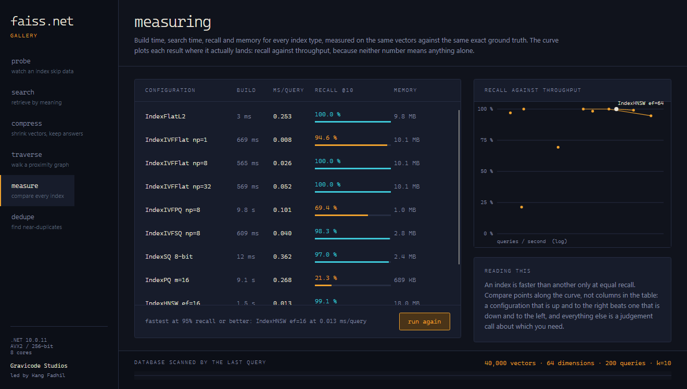

# FAISS.Net

**High-performance similarity search for .NET.** A from-scratch port of [FAISS](https://github.com/facebookresearch/faiss) to managed C# — no native binaries, no P/Invoke — with an API deliberately shaped like the Python one so existing FAISS code translates statement by statement.

*Read this in [Bahasa Indonesia](README.id.md).*

```csharp
using Faiss.Net;

var index = new IndexFlatL2(dimension: 128);
index.Add(vectors);
var results = index.Search(query, k: 10);
```

The same program in Python FAISS:

```python
index = faiss.IndexFlatL2(128)
index.add(vectors)
D, I = index.search(query, 10)
```

---

## Why this exists

FAISS is the reference implementation for vector search, and until now using it from .NET meant shipping native binaries, matching them to every target platform, and marshalling arrays across the boundary on every call. FAISS.Net is a real port: the algorithms are reimplemented on `Span<T>`, `System.Runtime.Intrinsics` and the .NET thread pool, so an index is an ordinary managed object you can build, search, serialize and debug like any other.

What that buys you:

- **One assembly, every platform .NET runs on.** No native dependency to build, ship, or version-match.
- **SIMD throughout.** Distance kernels dispatch to AVX-512, AVX2, SSE or NEON at runtime; nothing is scalar unless the hardware makes it so.
- **Zero-allocation search.** Scratch memory comes from `ArrayPool<T>`; a warm query allocates nothing.
- **Python-shaped API.** `Train`, `Add`, `Search`, `RangeSearch`, `Reconstruct`, `RemoveIds`, `index_factory` — all present, all spelled the way you already know.

---

## Install

```bash
dotnet add package FAISS.Net
dotnet add package FAISS.Net.Gpu   # optional, ILGPU-backed CUDA/OpenCL
```

Targets **.NET 10**.

---

## The gallery

`FAISS.Net Gallery` is an Avalonia desktop app that makes the trade-offs tangible — every screen measures a real index on real vectors and shows what the choice cost.

```bash
dotnet run -c Release --project samples/Faiss.Net.Gallery
```


The band across the bottom is the whole database, divided into the index's cells. The lit fraction is what the last query actually examined — 243 vectors out of 40,000, 0.6%, for 94.6% of the correct answers. Drag `nprobe` and watch it fill in.



Every index type measured on the same vectors against the same exact ground truth, with each configuration plotted where it lands on the recall/throughput frontier.

[See all six screens →](docs/en/gallery.md)

---

## What's included

| | |
|---|---|
| **Exact** | `IndexFlatL2`, `IndexFlatIP`, `IndexFlat` |
| **Inverted file** | `IndexIVFFlat`, `IndexIVFPQ`, `IndexIVFScalarQuantizer` |
| **Graph** | `IndexHNSWFlat` |
| **Compressed flat** | `IndexPQ`, `IndexScalarQuantizer` |
| **Binary** | `IndexBinaryFlat`, `IndexBinaryIVF` |
| **Composition** | `IndexIDMap`, `IndexIDMap2`, `IndexPreTransform`, `IndexReplicas`, `IndexShards` |
| **Transforms** | `PCAMatrix`, `OPQMatrix`, `RandomRotationMatrix`, `NormalizationTransform` |
| **Quantizers** | `ProductQuantizer`, `ScalarQuantizer`, `Kmeans` |
| **GPU** | `IndexFlatL2Gpu`, `IndexFlatIPGpu`, `StandardGpuResources` |
| **Persistence** | Versioned binary format, byte-array serialization, `MappedIndexFlat` |

Metrics: squared L2, inner product, L1, L-infinity.

---

## A tour in five minutes

**Exact search** — the reference, and the right answer up to a few hundred thousand vectors.

```csharp
var index = new IndexFlatL2(128);
index.Add(database);                          // flat n × d, row-major
var (distances, labels) = index.Search(queries, k: 10);
```

**Make it sublinear** — partition the space, then look at only part of it.

```csharp
var index = new IndexIVFFlat(dimension: 128, nlist: 1024);
index.Train(sample);                          // learn the cell centroids
index.Add(database);
index.Nprobe = 8;                             // the recall/speed dial, changeable any time
```

**Make it fit** — product quantization, 32× smaller at the same query cost.

```csharp
var index = new IndexIVFPQ(dimension: 128, nlist: 1024, m: 16);
index.Train(sample);
index.Add(database);
Console.WriteLine($"{index.CompressionRatio:F0}x smaller than flat");
```

**Make it fast** — a proximity graph, sub-millisecond at high recall.

```csharp
var index = new IndexHNSWFlat(128, m: 32) { EfConstruction = 80, EfSearch = 64 };
index.Add(database);                          // no training step
```

**Compose a recipe** — the factory understands FAISS strings.

```csharp
var index = FaissNet.IndexFactory(128, "OPQ16,IVF4096,PQ16");
```

**Cosine similarity** — normalize, then use inner product.

```csharp
var index = new IndexPreTransform(new NormalizationTransform(128), new IndexFlatIP(128));
index.Add(embeddings);                        // queries are normalized too, automatically
```

**Your own ids, and deletion.**

```csharp
var index = new IndexIDMap2(new IndexFlatL2(128));
index.AddWithIds(vectors, documentIds);
index.RemoveIds(id => IsDeleted(id));         // surviving ids never change
```

**Save, load, memory-map.**

```csharp
FaissNet.WriteIndex(index, "corpus.index");
var reloaded = FaissNet.ReadIndex("corpus.index");

MappedIndexFlat.Write(flat, "corpus.mmap");
using var mapped = MappedIndexFlat.Open("corpus.mmap");   // paged from disk, nothing loaded
```

**GPU**, as a drop-in replacement.

```csharp
using var index = new IndexFlatL2Gpu(128);
index.Add(database);
var results = index.Search(queries, 10);      // identical API, identical results
```

---

## Choosing an index

| Situation | Use | Why |
|---|---|---|
| Under ~100k vectors | `IndexFlatL2` | Exact, no training, no tuning. Nothing else is worth the complexity. |
| Needs to be faster | `IndexIVFFlat` | Exact within probed cells. `Nprobe` is the only dial. |
| Needs sub-millisecond | `IndexHNSWFlat` | Fastest at high recall; costs memory and build time. |
| Doesn't fit in memory | `IndexIVFScalarQuantizer` | 4× smaller, usually under a point of recall lost. |
| Doesn't fit by a lot | `IndexIVFPQ` | 16–64× smaller. The billion-scale standard. |
| Larger than RAM | `MappedIndexFlat` | Searched from disk, shared between processes. |
| Binary codes | `IndexBinaryFlat` | XOR and popcount; 32× smaller than float32. |

Fuller guidance, including how to size `nlist`, `m` and `efSearch`: **[Choosing an index](docs/en/choosing-an-index.md)**.

---

## Documentation

| | |
|---|---|
| [Getting started](docs/en/getting-started.md) | Install, first index, the shape of the API |
| [Choosing an index](docs/en/choosing-an-index.md) | Every index type, when to use it, how to size it |
| [API reference](docs/en/api-reference.md) | Types, methods, and the Python equivalent of each |
| [Architecture](docs/en/architecture.md) | How it works inside, and why it is built this way |
| [Performance](docs/en/performance.md) | What is optimized, what is measured, what is not |
| [The Gallery](docs/en/gallery.md) | All six demo screens, explained |

Project tracking: **[PLAN.md](PLAN.md)** (roadmap) · **[Progress.md](Progress.md)** (what is done,
what is not, and the bugs found along the way).

Also in **[Bahasa Indonesia](docs/id/)**.

---

## Repository layout

```
src/Faiss.Net              the library
src/Faiss.Net.Gpu          ILGPU backend (CUDA / OpenCL / CPU fallback)
samples/…Samples.Console   guided tour, one section per concept
samples/…Gallery           Avalonia desktop app
tests/…Tests               82 tests: correctness, recall, round-trips
benchmarks/                matched suite vs Python FAISS, plus BenchmarkDotNet
docs/                      English and Indonesian documentation
```

## Building

```bash
dotnet build                                    # everything
dotnet test                                     # 82 tests
dotnet run -c Release --project samples/Faiss.Net.Samples.Console
dotnet run -c Release --project samples/Faiss.Net.Gallery
```

Benchmarks — Release only, and comparable to Python FAISS because both sides read the same vectors:

```bash
dotnet run -c Release --project benchmarks/Faiss.Net.Benchmarks -- gendata --out data
dotnet run -c Release --project benchmarks/Faiss.Net.Benchmarks -- suite --data data --out results-dotnet.json
python benchmarks/python/bench_faiss.py --data data --out results-python.json
python benchmarks/python/compare.py results-dotnet.json results-python.json
```

See **[benchmarks/README.md](benchmarks/README.md)** for how to read the results — and for why comparing speed at unequal recall proves nothing.

---

## Differences from FAISS

Deliberate, and worth knowing before you port something:

- **`FaissNet.X()` instead of `faiss.x()`.** The module-level functions live on a static class named `FaissNet`, because the required root namespace `Faiss.Net` already binds the name `Faiss` and a namespace shadows a type of the same name at every call site.
- **The file format is FAISS.Net's own.** Indexes do not round-trip between FAISS.Net and FAISS. Rebuild from source vectors to move between them.
- **`IndexIVFPQ` encodes residuals for L2 and raw vectors for inner product.** The residual decomposition needs an extra correction term under inner product; encoding directly is simpler and exact against the decoded vector.
- **HNSW does not support removal**, matching FAISS. Rebuild, or filter removed ids out of results.
- **No IMI, no NSG, no RaBitQ, no `IndexRefine`.** The index families here cover the common ground; these are not implemented.

---

## Contributing

Tests must pass and benchmarks must not regress. Recall assertions run on seeded data, so a failure reproduces exactly rather than appearing once in ten runs.

```bash
dotnet test
dotnet run -c Release --project benchmarks/Faiss.Net.Benchmarks -- micro
```

## License

MIT.

---

Built by **Gravicode Studios**, led by **Kang Fadhil**.
