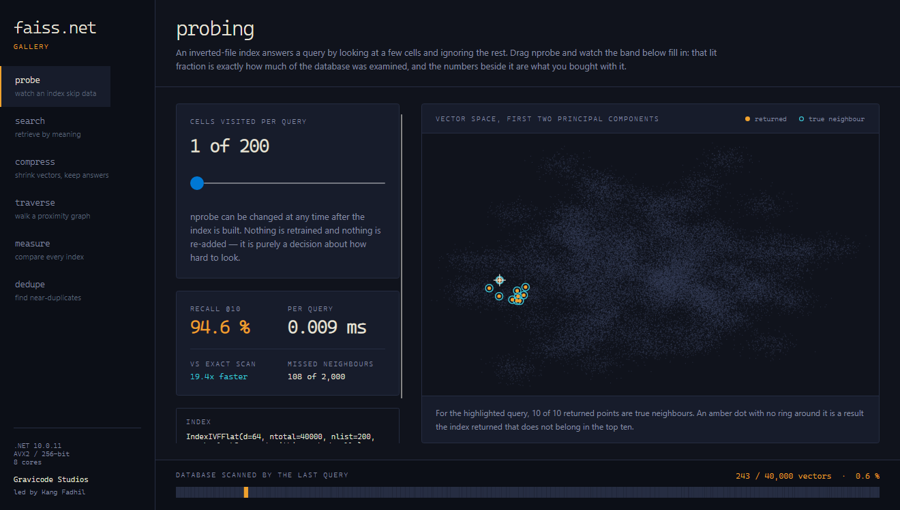

# Choosing an index

[← Documentation index](../README.md) · [Bahasa Indonesia](../id/memilih-index.md)

Every index here trades between three quantities: **recall**, **latency**, and **memory**. You cannot
have all three, and the whole skill is knowing which one your application can afford to give up.

The measurements below come from the Gallery: 40,000 vectors of dimension 64, 200 held-out queries,
`k = 10`, on 8 cores. Your numbers will differ; the *shape* of the trade-off will not.

---



## Start here

```
Under ~100k vectors?  ──────────────────────────────► IndexFlatL2
                                                       exact, no training, no tuning

Fits in memory, needs to be faster?  ───────────────► IndexIVFFlat
                                                       one dial: Nprobe

Needs sub-millisecond at high recall?  ─────────────► IndexHNSWFlat
                                                       costs memory and build time

Doesn't fit in memory?  ────────────────────────────► IndexIVFScalarQuantizer   (4x smaller)
                                                    └► IndexIVFPQ               (16-64x smaller)

Larger than RAM?  ──────────────────────────────────► MappedIndexFlat
```

Do not skip the first box. A flat scan of 100,000 × 128 vectors takes under a millisecond per query
on a modern core, is exact, needs no training, has no parameters to get wrong, and cannot silently
degrade as your data drifts. Reach for an approximate index when you have measured that you need
one.

---

## The index types

### IndexFlatL2 / IndexFlatIP — exact

Compares the query against every vector.

| | |
|---|---|
| Recall | 100%, by construction |
| Memory | `4 × n × d` bytes exactly, no overhead |
| Training | None |
| Removal | Yes (renumbers positions) |

```csharp
var index = new IndexFlatL2(128);
index.Add(vectors);
```

This is the reference every other index is measured against. Keep one around while you tune: without
exact ground truth you cannot compute recall, and without recall you are guessing.

---

### IndexIVFFlat — partition, then scan part of it

A coarse quantizer splits the space into `nlist` cells. A query visits the `Nprobe` nearest cells.

| | |
|---|---|
| Recall | Exact within probed cells; misses neighbours in cells not probed |
| Memory | Same as flat, plus 8 bytes per vector for its id |
| Training | Yes — k-means over the vectors |
| Removal | Yes, by id or predicate |

```csharp
var index = new IndexIVFFlat(dimension: 128, nlist: 1024);
index.Train(sample);
index.Add(vectors);
index.Nprobe = 8;
```

**Sizing `nlist`.** Start at `sqrt(n)`: 1,000 for a million vectors, 4,000 for 16 million. Larger
`nlist` means smaller cells, so each probe is cheaper but you need more probes for the same recall.
Training cost grows with `nlist`, and cells need roughly 40+ training points each to be
well-determined — `Kmeans` warns when they are not.

**Sizing `Nprobe`.** Start at 1 and raise it until recall is acceptable. Measured:

| nprobe | recall@10 | ms/query | vs exact |
|--:|--:|--:|--:|
| 1 | 94.6% | 0.005 | 36× faster |
| 8 | 100.0% | 0.018 | 10× faster |
| 32 | 100.0% | 0.035 | 5× faster |

Note the shape: recall saturates long before `nprobe` does. Everything past the saturation point is
latency you are paying for nothing — which is exactly why you measure instead of picking a number.

**The failure mode.** A true neighbour sitting just across a cell boundary is invisible unless that
cell is probed. This is one-sided: IVF never returns a wrong answer, it only fails to return a right
one. Check cell balance with `ListStatistics()`; a large max/mean ratio means some queries scan far
more than `Nprobe` suggests.

---

### IndexHNSWFlat — walk a graph

A layered proximity graph. Search descends sparse upper layers to land near the query, then explores
the base layer with a beam of width `EfSearch`.

| | |
|---|---|
| Recall | High — 98%+ at modest `EfSearch` on well-structured data |
| Memory | Vectors plus roughly `4 × (2M + M × levels)` bytes per vector |
| Training | **None** — no partition to go stale |
| Removal | **Not supported** |

```csharp
var index = new IndexHNSWFlat(128, m: 32) { EfConstruction = 80, EfSearch = 64 };
index.Add(vectors);   // construction is multi-threaded
```

Measured, 40,000 × 64:

| efSearch | recall@10 | ms/query |
|--:|--:|--:|
| 16 | 98.6% | 0.008 |
| 64 | 99.7% | 0.014 |

That is the fastest index in this library at high recall, by a wide margin. What you pay:

- **Memory.** The graph adds roughly 40–50% on top of the vectors at `M = 32`.
- **Build time.** Construction runs a full search per insertion. Seconds for tens of thousands of
  vectors, minutes for millions.
- **No deletion.** Removing a node strands the links pointing at it, and repairing the graph costs as
  much as rebuilding. Rebuild periodically, or keep a tombstone set and filter results.

**Sizing.** `M` is set at construction and cannot be changed: 16 for speed and memory, 32 for
general use, 48+ for high dimension or difficult data. `EfConstruction` buys graph quality at linear
build cost; 40–200 is the useful range. `EfSearch` is the only dial available afterwards, and it
must be at least `k`.

---

### IndexIVFScalarQuantizer — 4× smaller, almost free

An IVF index whose entries are scalar-quantized: each dimension stored as one byte against a learned
per-dimension range.

| | |
|---|---|
| Recall | ~98% of the equivalent IVFFlat |
| Memory | 4× smaller than flat |
| Training | Yes — k-means, plus a one-pass min/max |

```csharp
var index = new IndexIVFScalarQuantizer(128, nlist: 1024);
```

This is the first thing to try when an index stops fitting comfortably. It needs no clustering of the
vectors themselves, the accuracy cost is usually under a point, and the failure mode is gentle —
quantization error grows smoothly rather than falling off a cliff.

`ScalarQuantizerType` picks the trade: `Float16` (2× smaller, near-lossless), `PerDimension8Bit`
(4×, the default), `PerDimension4Bit` (8×, and visibly lossy — measured at 62.5% recall where 8-bit
gave 97.0%).

---

### IndexIVFPQ — 16-64× smaller, the billion-scale standard

An IVF index whose entries are product-quantized: the vector is split into `m` sub-vectors, each
replaced by a byte identifying its nearest centroid in a learned codebook.

| | |
|---|---|
| Recall | Materially lower — this is where the real accuracy cost lives |
| Memory | `m` bytes per vector plus 8 for its id |
| Training | Yes — k-means for cells, then one k-means per subspace |

```csharp
var index = new IndexIVFPQ(dimension: 128, nlist: 1024, m: 16);
index.Train(sample);
index.Add(vectors);
index.Nprobe = 8;
```

**Sizing `m`.** It must divide `d`. Each sub-quantizer is one byte at the default 8 bits, so `m = 16`
means a 16-byte code — 32× smaller than a 128-dimensional float vector. Larger `m` is more accurate
and larger; `d / m` between 4 and 16 is the sane range.

**Why it beats a standalone `IndexPQ` by so much.** Codes are stored as *residuals* from the cell
centroid. Cluster identity is already carried by the cell, so the entire code budget goes to the
within-cluster offset. In the Gallery's measurements the same 16-byte code gives 68.8% recall under
IVFPQ and 21.3% under a plain `IndexPQ` — the largest single gap in the table, and the reason IVFPQ
is the standard large-scale recipe.

**Add OPQ if your data is anisotropic.** PQ assumes every subspace carries comparable variance. Real
embeddings often concentrate energy in a few dimensions, which wastes most of the code budget:

```csharp
var index = FaissNet.IndexFactory(128, "OPQ16,IVF1024,PQ16");
```

OPQ learns the rotation that spreads variance evenly. It costs training time only — query cost and
memory are identical.

---

### IndexPQ / IndexScalarQuantizer — compressed, still exhaustive

Every vector is compared; only the bytes shrink. No cells means no pruning, so recall loss comes
purely from quantization.

Use these when the candidate set must not be pruned but memory must shrink — or as a component
inside something else.

Be aware of what `IndexPQ` alone does on strongly clustered data: with no coarse quantizer to carry
cluster identity, the codebook spends its budget on *which* cluster and has nothing left to rank
*within* one. Measured at 21.3% recall where IVFPQ with the same code size reached 68.8%.

---

### IndexBinaryFlat / IndexBinaryIVF — Hamming space

For codes from hashing or a binarized network. Distance is XOR plus popcount — the cheapest
comparison a CPU can make.

```csharp
var index = new IndexBinaryFlat(dimension: 256);   // bits, must be a multiple of 8
index.Add(codes);                                  // packed bytes
```

32× smaller than float32 and extremely fast. Recall is exact *with respect to the codes*; whatever
was lost was lost when the vectors were binarized.

---

### MappedIndexFlat — larger than RAM

A read-only flat index whose vectors stay in a memory-mapped file.

```csharp
MappedIndexFlat.Write(flat, "corpus.mmap");
using var mapped = MappedIndexFlat.Open("corpus.mmap");
```

Nothing is copied at open time, so opening a 40 GB index is instant and costs no managed memory.
Several processes mapping the same file share one set of physical pages. Best for large, read-mostly
indexes searched in batches — a query touching cold pages waits on disk.

---

## Composition

These wrap another index rather than storing vectors themselves.

| Wrapper | Purpose |
|---|---|
| `IndexIDMap` / `IndexIDMap2` | Application ids instead of positions. `IDMap2` adds a reverse table so `Reconstruct` by id is a hash lookup. |
| `IndexPreTransform` | Applies transforms to added vectors *and* queries. How `OPQ16,IVF1024,PQ16` is built. |
| `IndexReplicas` | Same data in several sub-indexes, queries split across them. Scales throughput; the multi-GPU pattern. |
| `IndexShards` | Data split across sub-indexes, results merged. Scales capacity. |

---

## The factory

```csharp
var index = FaissNet.IndexFactory(128, "IVF1024,PQ16");
```

Reads left to right: optional transforms and an `IDMap` wrapper, then an optional `IVF<nlist>` level,
then the encoding.

| String | Builds |
|---|---|
| `Flat` | `IndexFlatL2` (or `IndexFlatIP` for inner product) |
| `IVF1024,Flat` | `IndexIVFFlat` |
| `IVF1024,PQ16` | `IndexIVFPQ` |
| `IVF1024,PQ16x8` | `IndexIVFPQ` with explicit bit width |
| `IVF1024,SQ8` | `IndexIVFScalarQuantizer` |
| `PQ16`, `SQ8`, `SQ4`, `SQfp16` | Compressed flat |
| `HNSW32` | `IndexHNSWFlat` |
| `PCA64,Flat` | PCA to 64 dimensions, then flat |
| `OPQ16,IVF1024,PQ16` | Learned rotation, then IVFPQ |
| `IDMap,Flat` | `IndexIDMap2` around a flat index |
| `L2norm,Flat` | Normalization, then flat |

Everything the factory builds can be composed by hand; it just makes the common recipes one line.

---

## Sizing summary

For **1 million vectors of dimension 128**:

| Index | Memory | Typical recall@10 | Notes |
|---|--:|--:|---|
| `IndexFlatL2` | 512 MB | 100% | The reference |
| `IndexHNSWFlat(M=32)` | ~700 MB | 99% | Fastest queries |
| `IndexIVFFlat(1024)` | 520 MB | 99% at nprobe=8 | Exact within cells |
| `IndexIVFSQ(1024)` | 136 MB | 98% | The easy 4× |
| `IndexIVFPQ(1024, m=16)` | 24 MB | 60–80% | The easy 20× |
| `IndexIVFPQ(1024, m=32)` | 40 MB | 75–90% | Better accuracy, still tiny |

Recall figures depend heavily on your data's structure. Measure on your own vectors — that is what
`FaissNet.ComputeRecall` and the benchmark suite are for.
