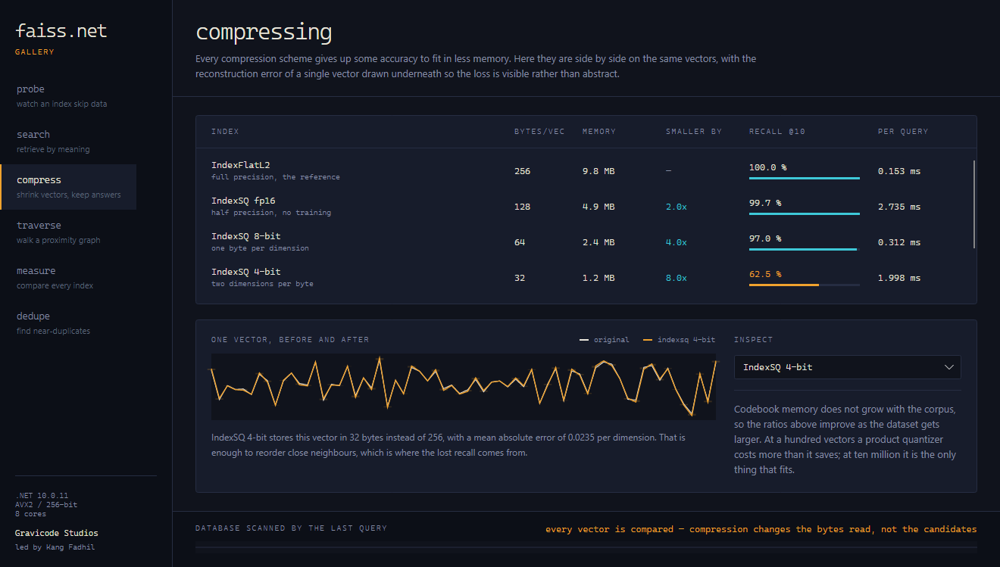
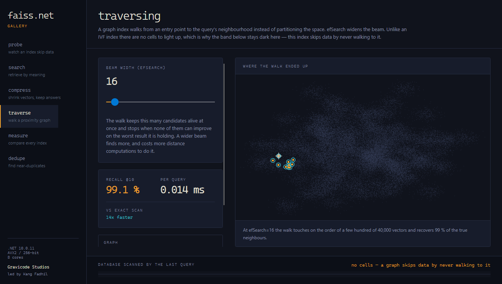
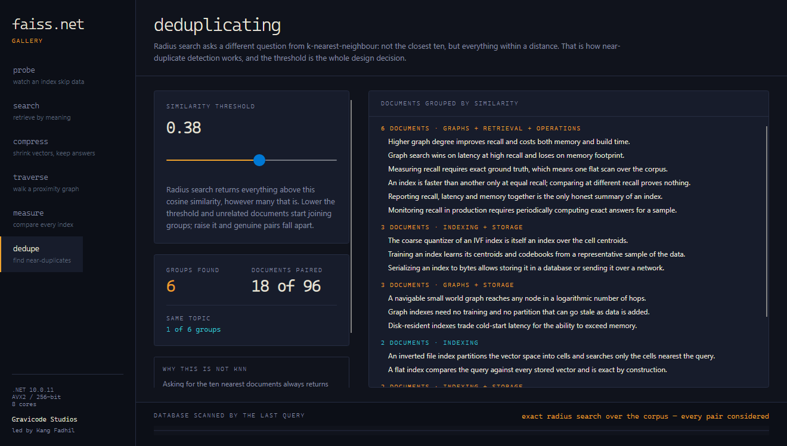

# Galeri

[← Indeks dokumentasi](../README.md) · [English](../en/gallery.md)

`FAISS.Net Gallery` adalah aplikasi desktop Avalonia yang dibuat untuk menjawab satu pertanyaan yang
tidak bisa dijawab dengan baik oleh sebuah tabel angka: **apa sebenarnya yang dikorbankan sebuah
index aproksimatif, dan apa yang didapat sebagai gantinya?**

Setiap layar mengukur index sungguhan pada vektor sungguhan — 40.000 vektor berklaster berdimensi 64
dengan 200 kueri yang disisihkan — terhadap ground truth eksak yang dihitung lewat pemindaian penuh.
Tidak ada yang disimulasikan dan tidak ada angka yang sekadar ilustrasi.

```bash
dotnet run -c Release --project samples/Faiss.Net.Gallery
```

Tangkapan layar di bawah dihasilkan oleh aplikasinya sendiri:

```bash
dotnet run -c Release --project samples/Faiss.Net.Gallery -- --capture docs/images
```

---

## Membaca antarmukanya

Dua warna aksen membawa makna tetap di seluruh aplikasi, dan tidak pernah berarti hal lain:

- **Amber** — *aproksimatif*. Apa yang dipilih index untuk dipindai, sel yang diperiksanya, hasil yang
  ditemukannya dengan melihat sebagian data.
- **Cyan** — *eksak*. Ground truth dari pemindaian penuh; rujukan untuk mengukur setiap aproksimasi.

Di bagian bawah setiap layar ada **pita probe**: seluruh basis data digambar sebagai satu pita,
dibagi menjadi sel-sel index sebanding dengan jumlah vektor di masing-masing sel, dengan sel yang
diperiksa kueri terakhir menyala amber. Inilah benang merah aplikasi ini. Pencarian aproksimatif
adalah keputusan untuk sengaja tidak melihat sebagian besar data Anda, dan pita itu membuat keputusan
tersebut terlihat.

---

## probe — melihat index melewatkan data


Index inverted-file atas 40.000 vektor dalam 200 sel. Pada `nprobe = 1` pita menunjukkan 243 vektor
diperiksa — 0,6% dari basis data — dan index tetap mengembalikan 94,6% tetangga yang benar, 27× lebih
cepat daripada pemindaian eksak.

Geser slider dan tiga hal bergerak bersamaan: bagian pita yang menyala, recall, dan jamnya. Plot
sebar di kanan memproyeksikan vektor ke dua komponen utama pertamanya dan menandai hasil satu kueri —
titik amber untuk yang dikembalikan index, cincin cyan untuk tetangga sejati. Titik amber tanpa
cincin di sekelilingnya adalah kesalahan yang bisa Anda tunjuk.

Panel di bawah slider melaporkan sebaran sel. Jarak besar antara sel terkecil dan terbesar berarti
partisinya tidak seimbang — penjelasan yang biasa untuk index IVF dengan latensi tak menentu:
`nprobe` menghitung sel, bukan vektor, dan sebagian sel jauh lebih mahal untuk dibuka.

---

## search — mencari berdasarkan makna


Korpus 96 kalimat teknis dalam delapan topik, di-embed dengan cara meng-hash kata menjadi arah
pseudo-acak lalu menjumlahkannya, kemudian diindeks dengan `IndexFlatIP` untuk cosine similarity.

Hasil diperbarui pada setiap ketukan tombol, dan itu masuk akal justru karena pemindaian eksak atas
96 vektor satuan hanya memakan sekitar 1,9 milidetik — menyadarinya adalah inti bagian ini. **Tidak
semua korpus butuh index aproksimatif.** Kata yang dipakai bersama oleh kueri dan tiap hasil disorot,
sehingga kualitas peringkat bisa dinilai dengan membaca, bukan dengan memercayai skor.

Embedding-nya sungguhan tapi sederhana: tumpang tindih kata, bukan makna. "Fast" dan "quick" adalah
arah yang tak berhubungan di sini. Sebuah sentence-transformer akan memperbaikinya dan bisa
dipasangkan ke index yang sama tanpa perubahan — separuh bagian retrieval layar ini tak perlu diubah
satu baris pun.

---

## compress — mengecilkan vektor, mempertahankan jawaban



Setiap skema kompresi di pustaka ini pada vektor yang sama: byte per vektor, memori terpakai, rasio
kompresi, recall, dan waktu kueri, berdampingan.

Di bawahnya, satu vektor digambar dua kali — aslinya sebagai garis putih tulang, hasil dekodenya
dengan amber, dan selisih di antaranya diarsir. Satu angka galat rekonstruksi hanya bilang sebuah
skema kehilangan 0,0235 per dimensi. Ia tidak bilang apakah kehilangan itu merata atau terpusat di
dimensi yang membawa sinyal, padahal kedua situasi itu memeringkat hasil dengan sangat berbeda.
Arsiran itulah yang menunjukkan mana yang terjadi.

Pola pada tabelnya yang paling berguna: scalar quantization 8 bit 4× lebih kecil dengan sekitar tiga
poin recall, sedangkan 4 bit 8× lebih kecil tetapi melepas hampir empat puluh poin. Kompresi bukan
tuas yang mulus.

---

## traverse — menyusuri graf kedekatan



Pasangan struktural dari layar probe: data sama, metrik sama, cara menghindari pekerjaan yang sama
sekali berbeda. HNSW membangun graf berlapis lalu menyusurinya, jadi tidak ada sel untuk dilewati —
ia melewatkan data dengan cara tidak pernah berjalan ke sana. Pita di bawah tetap gelap di layar ini,
dan menyebutkan alasannya.

`EfSearch` adalah lebar berkas pencariannya. Panel isi lapisan menunjukkan hierarki sebagaimana
benar-benar terbentuk: seluruh simpul di lapisan 0, kira-kira satu dari `M` di tiap lapisan di
atasnya, lima simpul di puncak. Penyusuran dimulai dari satu-satunya simpul yang menempati lapisan
tertinggi lalu menurun.

---

## measure — membandingkan semua index


Sepuluh konfigurasi dibangun dan diukur berurutan terhadap ground truth yang sama, masing-masing
diplot pada kurva recall/throughput begitu selesai.

Grafiknya menolak menampilkan kecepatan dan akurasi secara terpisah, karena secara terpisah keduanya
tak berarti apa-apa. Titik yang berada di kiri sekaligus di bawah titik lain memang lebih buruk —
lebih lambat *dan* kurang akurat. Titik hanya dihubungkan garis bila berasal dari sapuan yang sama,
sehingga tangga `nprobe` terbaca sebagai jalur sementara keluarga index yang tak berkaitan tetap
terpisah.

Bagian bawah menyebut konfigurasi tercepat yang mencapai recall 95% — pertanyaan yang sebenarnya
dibawa kebanyakan orang saat datang.

---

## dedupe — mencari duplikat mendekati



Radius search mengajukan pertanyaan yang berbeda dari k-nearest-neighbour: bukan sepuluh yang
terdekat, melainkan semua yang berada dalam jarak tertentu — berapa pun jumlahnya, termasuk nol.
Deteksi duplikat mendekati membutuhkan pertanyaan kedua, karena meminta sepuluh dokumen terdekat
selalu mengembalikan sepuluh, entah ada yang benar-benar berkaitan atau tidak.

Kelompok dibentuk dengan union-find atas pasangan yang dikembalikan radius search. Itu juga pelajaran
dari layar ini: union-find bersifat transitif, jadi menurunkan ambang cukup jauh akan meleburkan
seluruh korpus menjadi satu kelompok lewat rantai pasangan yang masing-masing lemah. Aplikasi
menyebutkannya secara eksplisit ketika itu terjadi. Inilah kegagalan klasik deduplikasi berbasis
ambang, dan alasan ambang sebaiknya ditetapkan dari pasangan yang terukur, bukan ditebak.

---

## Di balik layar

Galeri adalah konsumen FAISS.Net biasa — tidak memakai API internal apa pun. Berguna diketahui bila
Anda membaca kodenya:

- **`Workspace`** membangun data bersama sekali saja, di thread latar. Basis data dan kueri berasal
  dari satu penarikan lalu dipecah, sehingga kuerinya sedistribusi. Membangkitkannya secara terpisah
  akan membuat setiap index aproksimatif tampak jauh lebih buruk daripada kenyataannya.
- **`ProbeBand`, `ScatterPlot`, `TradeoffCurve`, `ReconstructionStrip`** adalah kontrol kustom yang
  digambar langsung dengan `DrawingContext`. Tanpa pustaka grafik.
- **`--capture DIR`** merender tiap layar ke PNG di luar layar; begitulah tangkapan layar ini dibuat —
  persis, dapat direproduksi, dan bersih dari apa pun yang kebetulan ada di desktop.

---

Dibuat oleh **Gravicode Studios**, dipimpin oleh **Kang Fadhil**.
