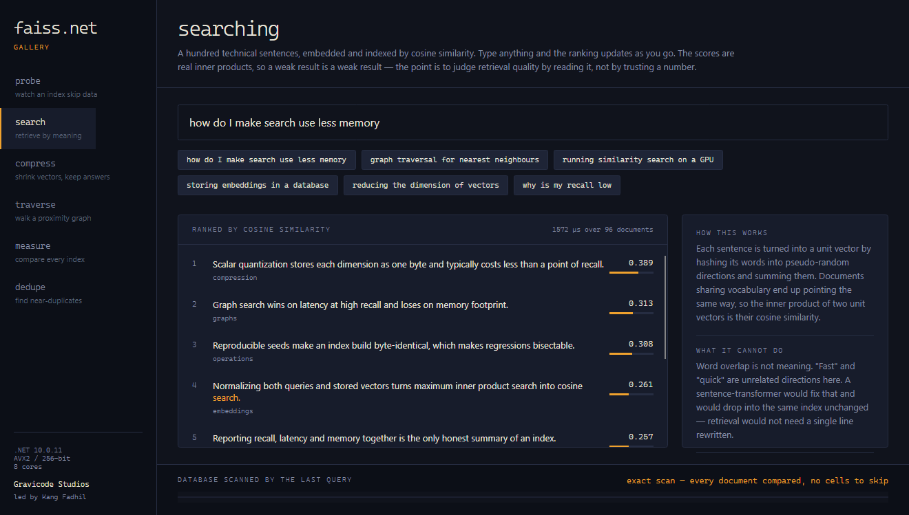

# Memulai

[← Indeks dokumentasi](../README.md) · [English](../en/getting-started.md)

---

## Instalasi

```bash
dotnet add package Gravicode.FaissNet
dotnet add package Gravicode.FaissNet.Gpu   # opsional
```

Menargetkan .NET 10. Satu assembly terkelola; tidak ada dependensi native yang perlu dipasang atau
dicocokkan versinya.

---

## Index pertama Anda

```csharp
using Faiss.Net;

// 1000 vektor berdimensi 128, datar dan row-major
float[] vectors = FaissNet.RandomVectors(1000, 128);

var index = new IndexFlatL2(dimension: 128);
index.Add(vectors);

var results = index.Search(vectors.AsSpan(0, 128), k: 5);

foreach (var (id, distance) in results.Neighbors())
    Console.WriteLine($"{id}  {distance:F4}");
```

Itu index eksak. Ia membandingkan kueri dengan setiap vektor yang tersimpan, sehingga recall-nya 100%
secara konstruksi — dan sampai beberapa ratus ribu vektor, biasanya inilah jawaban yang paling tepat.

---

## Cara data dikirim

Vektor dikirim sebagai **span datar row-major**: `n * d` float, satu vektor setelah vektor lain.
Persis seperti array NumPy kontigu sampai ke FAISS, dan itulah alasan API menerima
`ReadOnlySpan<float>` alih-alih `float[][]` — tanpa penelusuran pointer, tanpa alokasi per baris, dan
seluruh batch bisa di-pin sekali saja.

```csharp
// tiga vektor 4 dimensi
float[] batch = [ 1,0,0,0,  0,1,0,0,  0,0,1,0 ];
index.Add(batch);          // n disimpulkan: 12 / 4 = 3
```

Input jagged juga bisa, dan akan disalin ke penyimpanan datar:

```csharp
float[][] rows = [ [1,0,0,0], [0,1,0,0] ];
index.Add(rows);
```

Satu kueri cukup `d` float:

```csharp
var results = index.Search(new float[] { 1, 0, 0, 0 }, k: 3);
```

---

## Membaca hasil

`Search` mengembalikan `SearchResult` berisi dua buffer datar `n × k` — tuple `(D, I)` dari Python,
dijadikan satu objek.

```csharp
var results = index.Search(queries, k: 10);

// gaya Python, kalau Anda lebih suka
var (distances, labels) = results;

// per kueri
ReadOnlySpan<long> ids = results.LabelsFor(query: 0);
ReadOnlySpan<float> d  = results.DistancesFor(query: 0);

// satu tetangga
var (id, distance) = results[query: 0, rank: 0];

// atau iterasi, berhenti di slot kosong pertama
foreach (var (id, distance) in results.Neighbors(query: 0)) { }
```

Dua hal yang perlu diketahui:

- **Jarak L2 dikuadratkan.** FAISS melaporkan L2 kuadrat, begitu pula pustaka ini; gunakan
  `MathF.Sqrt` untuk jarak Euclidean sebenarnya. Urutan peringkat tidak terpengaruh.
- **Tetangga yang tidak ada bernilai `-1`.** Jika Anda meminta lebih banyak tetangga daripada yang
  tersedia, hasilnya tetap berbentuk `n × k` dan slot sisanya berlabel `-1`.

---

## Pelatihan

Sebagian index perlu mempelajari parameter — centroid sel, codebook, rotasi — sebelum bisa menyimpan
apa pun. Mereka akan memberi tahu Anda:

```csharp
var index = new IndexIVFFlat(dimension: 128, nlist: 1024);

index.Add(vectors);
// InvalidOperationException: IndexIVFFlat must be trained before use.
// Call Train(trainingVectors) first.

index.Train(sample);        // sampel yang representatif sudah cukup
index.Add(vectors);         // sekarang berhasil
```

Sampel pelatihan tidak harus seluruh dataset — yang penting distribusinya sama. Beberapa ratus vektor
per sel sudah lebih dari cukup, dan `Kmeans` memang melakukan subsampling di atas angka itu.
`IndexFlat*` dan `IndexHNSWFlat` tidak perlu dilatih sama sekali; `IsTrained` mereka sudah `true`
sejak dibuat.

---

## Cosine similarity

Cosine similarity adalah inner product dari vektor satuan, jadi normalisasi lalu pakai index inner
product:

```csharp
FaissNet.NormalizeL2(vectors, dimension: 128);

var index = new IndexFlatIP(128);
index.Add(vectors);

FaissNet.NormalizeL2(query, 128);       // kueri juga harus dinormalisasi
var results = index.Search(query, 10);  // skor dalam rentang [-1, 1]
```

Lupa menormalisasi kueri adalah kesalahan paling sering di sini, dan kegagalannya senyap — hasil
tetap keluar, hanya saja salah. Letakkan normalisasi di dalam index dan hal itu tidak mungkin terjadi:

```csharp
var index = new IndexPreTransform(new NormalizationTransform(128), new IndexFlatIP(128));
index.Add(vectors);                     // dinormalisasi saat masuk
var results = index.Search(query, 10);  // dan kueri dinormalisasi otomatis
```

---

## Membuatnya lebih cepat

Ketika pemindaian penuh terlalu lambat, partisi ruangnya dan cari sebagiannya saja:

```csharp
var index = new IndexIVFFlat(dimension: 128, nlist: 1024);
index.Train(sample);
index.Add(vectors);

index.Nprobe = 8;   // kunjungi 8 dari 1024 sel
```

`Nprobe` adalah tuas antara recall dan latensi, dan bisa diubah kapan saja setelah index dibangun —
tanpa pelatihan ulang, tanpa penambahan ulang. Mulai dari 1, naikkan sampai recall memadai, berhenti.

Ukur, jangan menebak:

```csharp
var exact = new IndexFlatL2(128);
exact.Add(vectors);
var truth = exact.Search(queries, 10);

foreach (int nprobe in new[] { 1, 4, 8, 16, 32 })
{
    index.Nprobe = nprobe;
    double recall = FaissNet.ComputeRecall(truth, index.Search(queries, 10));
    Console.WriteLine($"nprobe={nprobe,3}  recall@10 = {recall:P1}");
}
```

---

## Membuatnya muat

Ketika vektornya tidak lagi muat di memori, kompres:

```csharp
// 4x lebih kecil, biasanya di bawah satu poin recall
var sq = new IndexIVFScalarQuantizer(128, nlist: 1024);

// 32x lebih kecil, dengan biaya akurasi yang nyata
var pq = new IndexIVFPQ(128, nlist: 1024, m: 16);
```

Keduanya dilatih dan diisi dengan cara yang sama. `CompressionRatio` melaporkan hasilnya, dan
`MemoryUsage` melaporkan byte terpakai untuk index apa pun.

---

## Id milik Anda sendiri

Posisi di dalam index jarang sama dengan id aplikasi Anda. Bungkus index-nya:

```csharp
var index = new IndexIDMap2(new IndexFlatL2(128));
index.AddWithIds(vectors, documentIds);

var results = index.Search(query, 10);   // label berisi id Anda

index.RemoveIds(id => IsDeleted(id));    // id yang tersisa tidak pernah berubah
```

`IndexIVF*` menyimpan id secara native dan tidak memerlukan pembungkus; panggil `AddWithIds`
langsung padanya.

---

## Menyimpan dan memuat

```csharp
FaissNet.WriteIndex(index, "corpus.index");
var reloaded = FaissNet.ReadIndex("corpus.index");
```

Index komposit tersimpan utuh — `IndexPreTransform` yang membungkus `IndexIVFPQ` dengan coarse
quantizer `IndexFlatL2` ditulis dan dipulihkan dalam satu panggilan. Untuk menyimpan index di tempat
selain berkas:

```csharp
byte[] bytes = IndexIO.Serialize(index);
var restored  = IndexIO.Deserialize(bytes);
```

Untuk index yang lebih besar daripada memori, tulis dalam bentuk mappable dan cari langsung dari
disk:

```csharp
MappedIndexFlat.Write(flat, "corpus.mmap");
using var mapped = MappedIndexFlat.Open("corpus.mmap");
var results = mapped.Search(queries, 10);
```

---

## Selanjutnya ke mana

- **[Memilih index](memilih-index.md)** — setiap jenis index, kapan dipakai, cara menakarnya.
- **[Referensi API](referensi-api.md)** — seluruh permukaan API, dengan padanan Python-nya.
- **[Performa](performa.md)** — apa yang dioptimasi dan bagaimana pengukurannya.
- **Contoh konsol** — tur berpandu dengan angka, satu bagian per konsep:

  ```bash
  dotnet run -c Release --project samples/Faiss.Net.Samples.Console -- help
  ```

- **[Galeri](gallery.md)** — kompromi yang sama, tapi interaktif.

  
