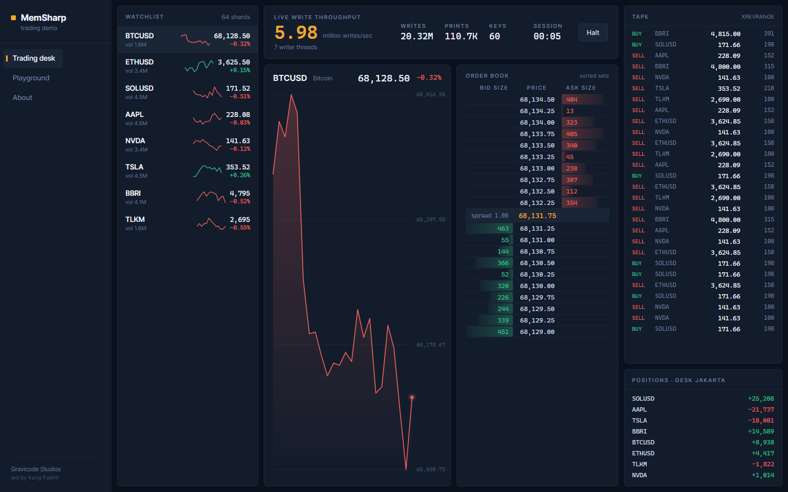
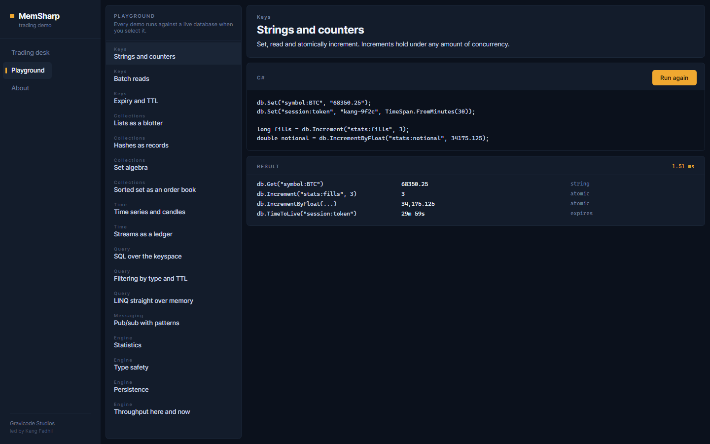
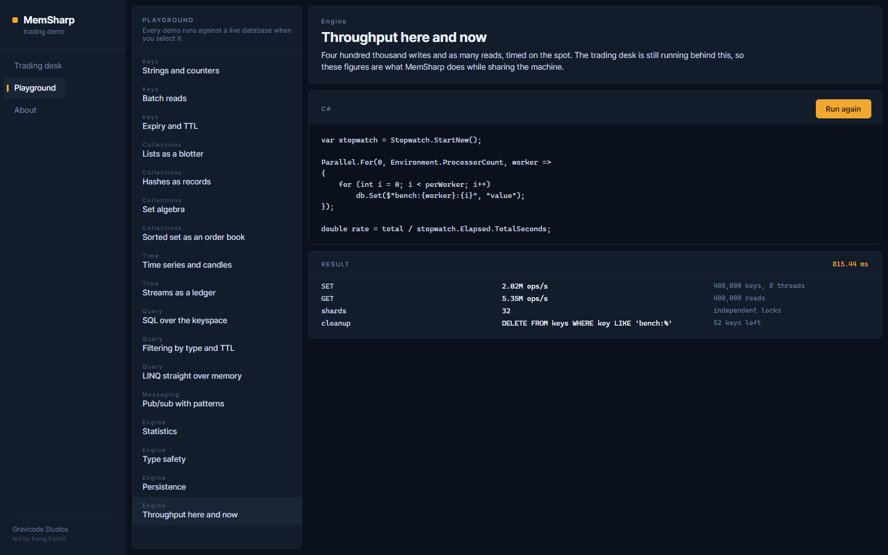
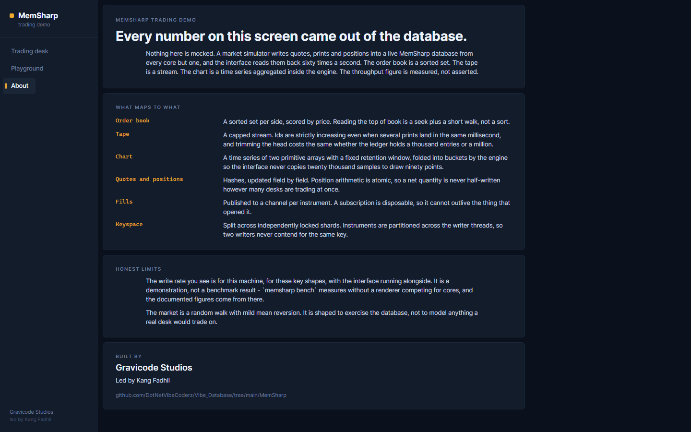

# The trading demo

[Bahasa Indonesia](../id/trading-demo.md) · [Docs index](README.md)

An Avalonia desktop app that puts the engine under real load. Everything on screen is read back out
of a live MemSharp database — nothing is mocked, and the throughput figure is measured rather than
asserted.

```bash
dotnet run -c Release --project samples/MemSharp.TradingDemo
```

Release matters. In Debug the numbers are an order of magnitude out and the interface stutters.

---

## The trading desk



A simulated market writes into the database from every core but one; the interface reads it back
twenty times a second.

| On screen | In the database |
|---|---|
| Watchlist prices and sparklines | `quote:{symbol}` hashes, `px:{symbol}` time series |
| The depth ladder | `book:{symbol}:bids` and `:asks` sorted sets, scored by price |
| The chart | `px:{symbol}` folded into candles by `TS.AGGREGATE` |
| The tape | `tape`, a stream capped at 5,000 entries |
| Positions | `pos:{account}` hashes, updated with atomic per-field arithmetic |
| Volume | `vol:{symbol}` counters |

The write-rate readout gets the largest type on the page because it is the claim the whole demo is
making. Around **6.3 million writes a second** on an 8-core Ryzen, while rendering.

### The ladder

The signature control, and the reason it is drawn rather than composed from panels. Depth bars bleed
outward from the price spine on a scale shared across both sides, so an imbalanced book is legible at
a glance rather than by reading. A ladder built from twenty nested panels would also allocate twenty
containers per repaint at sixty frames a second — the sort of overhead that makes a fast database
look slow.

Reading it: asks descend to the spread from above, bids descend below, and the mid and spread sit in
the band between them. Sizes hug the spine; depth grows away from it.

### Why the interface refreshes at 20 Hz and not with the writes

The engine writes as fast as the machine allows; the interface samples on a fixed timer regardless.
Coupling them would either throttle the engine to whatever the renderer can keep up with, or produce
a window repainting faster than a screen can show and a number nobody can read.

What you are looking at is a database that millions of writes a second are landing in, sampled at
reading pace.

---

## The playground



Seventeen runnable demonstrations. Each shows what it does, the C# that does it, and the result — with
the snippet directly above its output so the page reads as cause then effect.

The code string and the delegate that runs are written to match line for line. That is the whole
value of the page: you can copy what is on screen and get what is on screen.

| Group | Demos |
|---|---|
| Keys | Strings and counters · Batch reads · Expiry and TTL |
| Collections | Lists as a blotter · Hashes as records · Set algebra · Sorted set as an order book |
| Time | Time series and candles · Streams as a ledger |
| Query | SQL over the keyspace · Filtering by type and TTL · LINQ straight over memory |
| Messaging | Pub/sub with patterns |
| Engine | Statistics · Type safety · Persistence · Throughput here and now |



The last one times four hundred thousand writes and as many reads on the spot — while the trading
desk is still running behind it, so the figure is what MemSharp does *sharing* a machine.

The type-safety demo deliberately **fails**, and shows the error. A `WRONGTYPE` is a real part of the
API, and seeing the message is how someone learns what the engine rejects.

The playground gets its own database. Sharing the desk's would mean a demo that flushes it or floods
it silently changes what the desk is showing, and a playground has to be safe to poke at.

---

## About



What the demo is, which structure backs each panel, and — importantly — the honest limits: the write
rate is for this machine with the interface running alongside, and the market is a random walk shaped
to exercise the database rather than to model anything real.

---

## How the market works

`MarketEngine` runs `ProcessorCount - 1` threads, leaving a core for the interface. A demo that
renders at 3 fps while claiming millions of writes a second has not demonstrated anything anyone
wants.

**Instruments are partitioned across the workers, not shared.** Two workers never write the same
key, which is what lets the sharded keyspace actually deliver its concurrency. Sharing instruments
would turn the demo into a lock-contention benchmark.

Each tick per instrument:

1. A random walk with mild mean reversion moves the price — Box-Muller, so the steps are normally
   distributed rather than uniform.
2. Ten levels each side of the book are rewritten, and stale levels trimmed.
3. Roughly one tick in four crosses the spread and prints: to the tape, the price series, the quote
   hash, the volume counter, a position, and a pub/sub channel.

That is about 44 writes per tick per instrument.

### Two bugs the demo surfaced

Worth recording, because both were real engine-adjacent mistakes that only a live view exposed:

**A crossed book.** The first version trimmed only the far side of each book, so when the price
walked downward the old high bids stayed resting above the new asks. The ladder rendered a *negative
spread* — best bid above best ask — which is not a rendering glitch but a market that has stopped
making sense. The fix is a second trim per side, clearing levels the price has walked through: a bid
resting above the mid is one that would have been lifted.

**Volatility scaled for the wrong clock.** The per-tick volatilities were set at values that would be
plausible per *second*. A worker ticks its instruments hundreds of thousands of times a second, so
they compounded into a 4% move within six seconds — every instrument in freefall. They are now scaled
for the tick rate.

---

## Screenshots stay honest

The images in this documentation are rendered from the same window the app shows — same view models,
same theme, same market engine — through Avalonia's headless renderer:

```bash
dotnet run -c Release --project samples/MemSharp.TradingDemo -- --capture docs/images
```

CI runs this on every change. A hand-made mock-up would eventually drift away from the interface it
claims to depict; this cannot.

The runner pumps the dispatcher rather than sleeping, because the desk refreshes on a
`DispatcherTimer` that only ticks while a dispatcher loop is running — sleeping the thread would
capture a window that had never updated. It also lets the market run for four seconds before
capturing, since an empty ladder and a flat chart would show the layout but none of the behaviour.

---

## The design

A trading desk at night rather than a hacker terminal. The ground is a deep navy-slate (`#0B111C`),
not black, and only three colours carry meaning: bid green, ask coral, and the amber that identifies
MemSharp across the CLI and the docs. Nothing else gets a colour, so the two that matter always win
the eye.

Numbers are set in a monospace face throughout. In a ladder where digits must line up column by
column, proportional figures make a price look like it is moving when only its glyph widths changed.

Navigation is a left rail rather than tabs: this is a terminal, and terminals put navigation down the
side where it does not compete with the data for vertical space.

---

## Reading the source

| File | What it holds |
|---|---|
| `Market/MarketEngine.cs` | The simulator. Every write the demo makes is here. |
| `Market/MarketReader.cs` | Every read. Kept separate so it is obvious the numbers come from the database. |
| `Controls/DepthLadder.cs` | The ladder, one `Render` pass over two sorted-set queries. |
| `Controls/PriceChart.cs` | The chart, drawn from candles the engine aggregated. |
| `ViewModels/TradingDeskViewModel.cs` | The 20 Hz sampling loop. |
| `ViewModels/PlaygroundViewModel.cs` | All seventeen demos, code and delegate side by side. |
| `ScreenshotRunner.cs` | Headless capture. |
| `Theme.axaml`, `Palette.axaml` | The visual language. Split because a `ResourceDictionary` cannot hold `<Styles>`. |

If you want to see how to drive MemSharp hard from C#, `MarketEngine.cs` is the file — it is a
complete, working example of the write patterns the engine is built for.
